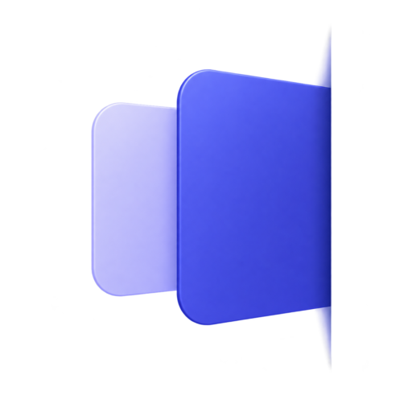

<p align="center">
  
</p>

# EasyFlow

EasyFlow is a native macOS edge workspace that keeps tasks and quick notes one movement away.

## Features

- Reveal the workspace by holding the pointer briefly at the far-right edge of the rightmost display.
- Capture multiline Quick Notes and reorder them directly.
- Create locally ordered Main Tasks with effort estimates from 1 to 4.
- Keep descriptions, Steps, and Attached Notes with each task.
- Move a Quick Note onto a task without copying or merging its text.
- Complete tasks into a five-item Recently Completed view. Completed tasks cannot be restored in v1.
- Synchronize Main Task title, completion, and existence through Apple Reminders.
- Start EasyFlow at login and choose Standard, Frosted, or Liquid Glass appearance where supported.
- Store EasyFlow-specific data locally, with no Dock or menu-bar workflow.

## Install EasyFlow

EasyFlow does not yet have a signed and notarized downloadable [GitHub Release](https://github.com/Natizh/easyflow/releases). The current installation path is to build the app from source. A future notarized release will support downloading, unzipping, and dragging EasyFlow into Applications without Terminal.

### Build from source

You need macOS 14 or later, Git, and a Swift 6 toolchain. Apple supplies Git and Swift through Xcode or the Xcode Command Line Tools.

1. Open Terminal from Applications > Utilities.
2. Check whether the tools are installed:

   ```sh
   git --version
   swift --version
   ```

3. If either command is missing, run this command and complete Apple’s installation prompt:

   ```sh
   xcode-select --install
   ```

4. Download the repository and enter its folder. The `cd easyflow` line changes Terminal into the downloaded project directory.

   ```sh
   git clone https://github.com/Natizh/easyflow.git
   cd easyflow
   ./scripts/build-release-app.sh
   ```

5. The app appears at `.build/release-app/EasyFlow.app`. Open that folder in Finder:

   ```sh
   open .build/release-app
   ```

6. Drag `EasyFlow.app` into Applications, then open it. Approve Reminders access when macOS asks. Launch at Login is available from EasyFlow Settings.

The source-built app is ad-hoc signed for local use, not signed with an Apple Developer ID and not notarized. It uses the default macOS application icon until a transparent production icon master is supplied. If macOS blocks the first launch, Control-click EasyFlow in Applications, choose Open, then confirm. A notarized release will not require this source-build step.

## How to use

1. Launch EasyFlow. It runs without a Dock icon or menu-bar item.
2. Move the pointer to the far-right edge of the rightmost display and hold it there for about 300 ms.
3. Type in the Quick Note composer. Return inserts a new line; Command+Return saves the note.
4. Select `+ New Task`, enter a title, and choose an effort from 1 to 4.
5. Hover a task to open its Secondary panel, then edit its Description, Steps, and Attached Notes.
6. Drag a Quick Note onto a task to move it into Attached Notes.
7. Drag tasks, Quick Notes, or Steps directly to reorder them.
8. Complete a Main Task to move it into Recently Completed. The five newest completed tasks are shown, and v1 has no restore action.
9. Open the gear in the Main Panel to change appearance, manage Reminders, or enable Launch at Login.

## Apple Reminders

EasyFlow uses a dedicated `EasyFlow` list in Apple Reminders.

The sync boundary includes:

- Main Task existence;
- title;
- completion.

These fields stay on the Mac:

- effort and order;
- Description;
- Steps and Step state;
- Quick Notes and Attached Notes;
- styling and EasyFlow-only UI state.

EasyFlow does not encode local-only data into Reminder notes, priority, or other fields.

## Privacy

EasyFlow has no account, backend, telemetry, or analytics. EasyFlow-specific data stays on the Mac. EventKit is used only for the Apple Reminders sync boundary described above.

## Requirements

For normal use:

- macOS 14 or later;
- Reminders permission for Main Task synchronization. Local workspace data remains available if access is denied.

Liquid Glass requires macOS 26. Standard and Frosted work on macOS 14 and later.

For a source build:

- Git;
- Swift 6 through Xcode or the Xcode Command Line Tools.

## Development

Run `swift build` and `swift test` before submitting changes. Current behavior and implementation boundaries are documented in [PRODUCT_SPEC.md](PRODUCT_SPEC.md), [ARCHITECTURE.md](docs/ARCHITECTURE.md), [DATA_MODEL.md](docs/DATA_MODEL.md), [UX_BEHAVIOR.md](docs/UX_BEHAVIOR.md), [REMINDERS_SYNC.md](docs/REMINDERS_SYNC.md), and [AGENTS.md](AGENTS.md).

## License

EasyFlow is available under the [MIT License](LICENSE).
