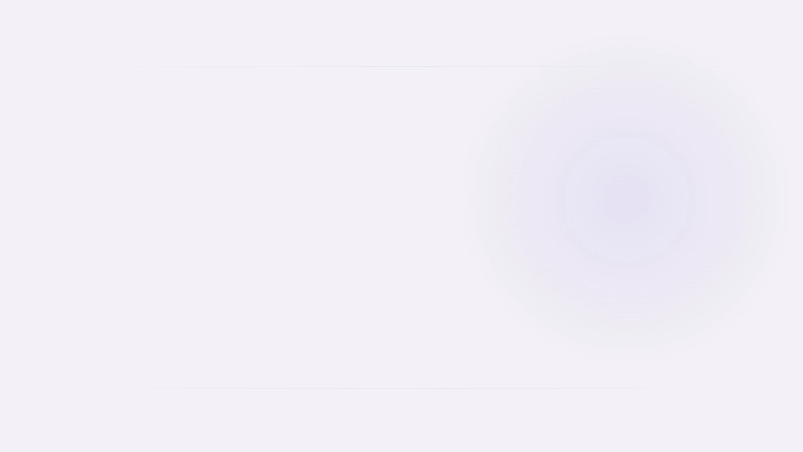

<h1 align="center">
  <picture>
    <source
      media="(prefers-color-scheme: dark)"
      srcset="assets/brand/easyflow-hero-dark.webp">
    <source
      media="(prefers-color-scheme: light)"
      srcset="assets/brand/easyflow-hero-light.webp">
    
  </picture>
</h1>

EasyFlow is a native macOS edge workspace for keeping quick notes and the tasks you are actively working on close at hand. Move the pointer to the far-right edge of the rightmost display and the workspace slides over the current app; move away and it gets out of the way.

## Install

### Download the app

EasyFlow releases are distributed through [GitHub Releases](https://github.com/Natizh/easyflow/releases) as `EasyFlow.zip`.

1. Open the Releases page and download `EasyFlow.zip` from the latest release.
2. Double-click the ZIP to extract `EasyFlow.app`.
3. Drag `EasyFlow.app` into your Applications folder.
4. Open EasyFlow and allow Reminders access when macOS asks.
5. If you want EasyFlow available after every login, enable **Launch at Login** in Settings.

The current community release is ad-hoc signed, not signed with an Apple Developer ID and not notarized. macOS may therefore block the first launch. If that happens, Control-click `EasyFlow.app`, choose **Open**, then confirm. If macOS still blocks it, open **System Settings → Privacy & Security** and choose **Open Anyway** for EasyFlow. This override is only needed for the first launch of that build.

If the Releases page does not contain a build yet, use the source installation below.

### Build and install from source

You need macOS 14 or later and Apple's Swift command-line tools. Open Terminal, then copy and run:

```sh
git clone https://github.com/Natizh/easyflow.git
cd easyflow
./scripts/install.sh
```

The installer builds the release app, copies it to `/Applications` when possible (otherwise `~/Applications`), and opens it. If Apple's command-line tools are missing, the script tells you how to install them with `xcode-select --install`.

## Use EasyFlow

1. Launch EasyFlow. It runs without a Dock icon or menu-bar item.
2. Move the pointer to the far-right edge of the rightmost display and hold it there briefly.
3. Type into Quick Notes. **Return** saves the note and readies the composer for the next one.
4. Select **New Task**, enter a title, and choose an effort from 1 to 4.
5. Hover a task to open its detail panel with Description, Steps, and Attached Notes.
6. Drag Quick Notes onto tasks to move them into Attached Notes.
7. Drag tasks, Quick Notes, and Steps directly to reorder them.
8. Complete a task to move it into Recently Completed. EasyFlow shows the five most recent completed tasks; v1 has no restore action.
9. Use the gear in the Main Panel for appearance, Reminders status, and Launch at Login.

## Features

- Edge activation from the far-right side of the rightmost display.
- Multiline Quick Notes with direct drag/reorder.
- Main Tasks with local effort, order, descriptions, Steps, styling, and Attached Notes.
- Quick Note → task movement without copying or merging note content.
- A contextual Secondary panel for task details and Quick Notes.
- Five-item Recently Completed view.
- Apple Reminders synchronization for Main Task existence, title, and completion.
- Standard and Frosted appearances on macOS 14+, with Liquid Glass available on macOS 26+.
- Launch at Login through native macOS APIs.
- Local SQLite storage with no EasyFlow account, backend, telemetry, or analytics.

## Apple Reminders

EasyFlow uses a dedicated `EasyFlow` list in Apple Reminders.

| Synced with Reminders | Kept local to EasyFlow |
| --- | --- |
| Main Task existence | Effort and order |
| Main Task title | Description |
| Main Task completion | Steps and Step state |
|  | Quick Notes and Attached Notes |
|  | Styling and EasyFlow-only UI state |

EasyFlow does not encode its local-only metadata into Reminder notes, priority, or other Reminder fields.

## Privacy

EasyFlow has no account, custom backend, telemetry, or analytics. EasyFlow-specific workspace data stays on the Mac. EventKit is used only for the Apple Reminders synchronization boundary above.

## Requirements

For normal use, EasyFlow requires macOS 14 or later. Reminders permission is required only for Main Task synchronization; the local workspace remains usable if access is denied. Liquid Glass requires macOS 26.

Building from source additionally requires Swift 6 through Xcode or the Xcode Command Line Tools.

## Development

Current behavior and implementation boundaries live in [PRODUCT_SPEC.md](PRODUCT_SPEC.md), [ARCHITECTURE.md](docs/ARCHITECTURE.md), [DATA_MODEL.md](docs/DATA_MODEL.md), [UX_BEHAVIOR.md](docs/UX_BEHAVIOR.md), [REMINDERS_SYNC.md](docs/REMINDERS_SYNC.md), and [AGENTS.md](AGENTS.md).

Run `swift build` and `swift test` before submitting changes. `./scripts/package-release.sh` creates a validated `dist/EasyFlow.zip` plus its SHA-256 checksum. Pushing a version tag that matches `CFBundleShortVersionString` (for example `v1.0.0`) runs the release workflow and publishes those files to GitHub Releases.

## License

EasyFlow is available under the [MIT License](LICENSE).
